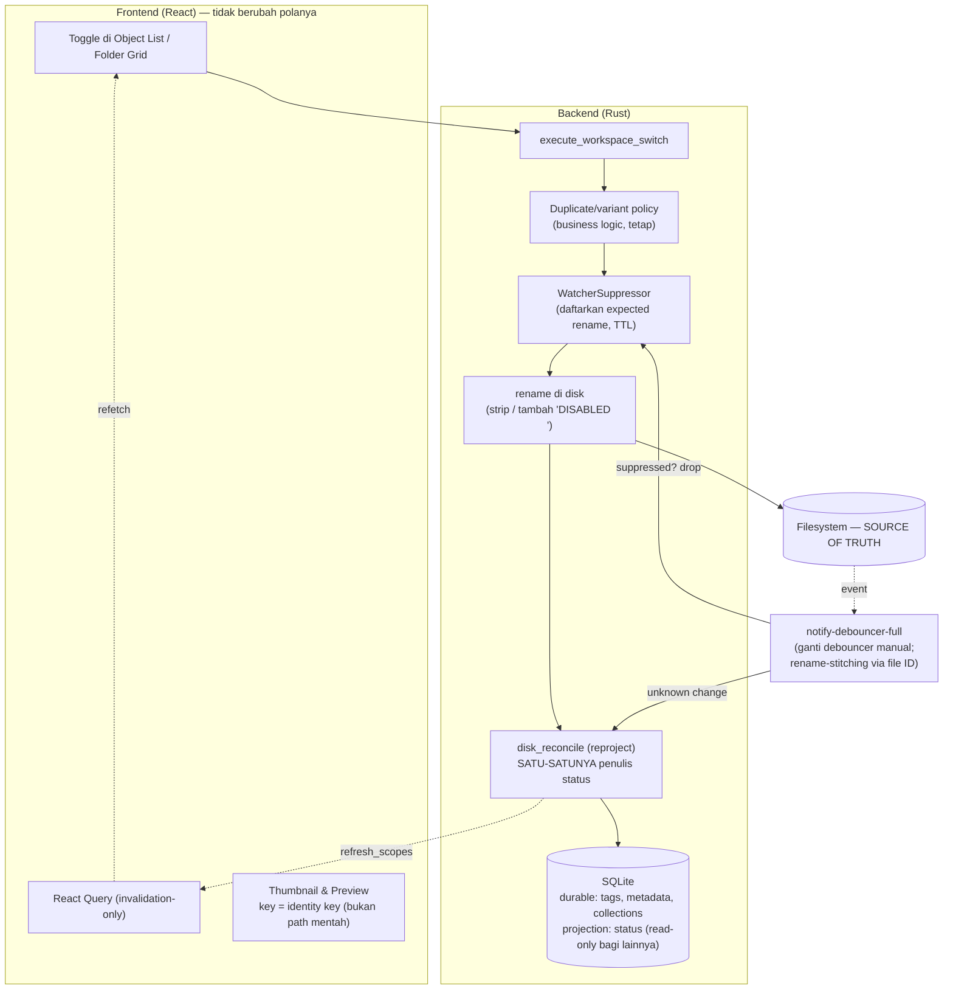

# Enable/Disable v2 — Disk sebagai Source of Truth

> **Status: DIIMPLEMENTASI PENUH (2026-08-09) + audit gap lulus.** Seluruh 9
> langkah §6 selesai; gate `status_is_written_by_disk_reconcile_only` aktif.
> Audit lanjutan menutup: reconcile yang hilang di ekstraksi arsip, import
> manual, drag-drop, dan trash-restore tanpa game_id; scope reconcile untuk
> implicit-swap lintas-root dan partial-failure organizer move; penulis status
> laten `UpdateObjectInput.status` (toggle di dialog Edit Object dihapus —
> menulis status tanpa rename = di-revert reconcile); thumbnail key frontend
> kini identity-based; fallback basename `pathRewrite` yang bisa merusak
> selection mod senama dihapus. Sisa debt sadar: (a) double refetch per toggle
> (event `disk_reconcile:result` + publish dari switch — perlu desain dedup,
> bukan quick fix), (b) selection compare masih case/separator-sensitive di
> beberapa titik, (c) flow broad tetap blanket-suppression by design,
> (d) scan-commit = penulis disk-derived kedua yang diizinkan gate.

Desain target rombakan sistem enable/disable (Workspace Switch). Menggantikan
desain lama yang dual-tracked (DB `status` + prefix folder) — dokumen versi
lama menggambarkan sistem berjalan; dokumen ini menggambarkan tujuan rombakan
dan urutan migrasinya. Project belum production, jadi tidak ada beban
kompatibilitas.

## 1. Prinsip

1. **Disk = satu-satunya fakta enabled/disabled.**
   - Nama folder diawali prefix disabled (case-insensitive, regex
     `^disabled[ _-]*`: menangkap `DISABLED `, `disabled_`, `DISabled-`) →
     **Disabled**.
   - Tanpa prefix → **Enabled**.
   - Saat app yang menulis, selalu kanonik `"DISABLED "`. Strip berulang
     untuk kasus `DISABLED DISABLED foo`.
2. **SQLite tetap ada, tapi perannya dibagi dua:**
   - **Durable store** untuk data yang tidak bisa diderive dari disk: tags,
     object_type (matching MasterDB), metadata JSON, collections, hash index,
     import jobs. Ini alasan SQLite tidak dihapus — filter `json_each` dan
     sort rarity tetap di SQL.
   - **Projection** untuk data yang bisa diderive: kolom `status` boleh tetap
     ada demi query cepat, tapi **penulisnya hanya satu**: reconcile-from-disk.
3. **Single writer.** Semua ~15 titik tulis `status` di luar reconcile
   (toggle, bulk, organizer move, scan commit, dedup, batch rename, sync,
   mutation engine) **dihapus**. Toggle tidak lagi menulis status — ia hanya
   rename di disk lalu memanggil reconcile scoped.
4. **Identity key.** Semua cache dan referensi lintas-rename di-key pakai
   path yang sudah **strip prefix disabled + case-fold** (arah yang sama
   dengan `folder_path_key` yang sudah ada di schema — perlu diverifikasi
   derivasinya memang strip prefix; kalau belum, ubah derivasinya).
   Konsekuensi: toggle tidak pernah meng-invalidate thumbnail, dan selection
   preview panel survive rename.

## 1b. Penyimpanan path & identitas (anti-drift kedua)

`folder_path` di DB adalah kelas masalah yang sama dengan `status`: salinan
dari fakta disk. Aturannya identik:

- **`folder_path` (path mentah saat ini) tetap disimpan** — pembaca butuh
  path absolut untuk rename/open-folder/thumbnail tanpa scan ulang — tapi
  statusnya **projection: hanya reconcile yang menulis**. Ini sejalan dengan
  gate arch yang sudah ada (`ModFolderPath`, "a stored path is not a
  filesystem path"): path tersimpan = display/identitas, path filesystem
  nyata di-resolve saat dipakai.
- **`folder_path_key` (identity) = path strip prefix disabled + case-fold.**
  Inilah kunci tempat data durable (tags, metadata, collections) menempel.
- **Toggle prefix TIDAK mengubah identity** → tags/collections/thumbnail
  tidak tersentuh. Ini inti desainnya.
- **Rename sungguhan / move MENGUBAH identity** → data durable harus ikut:
  1. App yang me-rename (organizer move, batch rename): migrasikan key dalam
     transaksi yang sama — sudah ada polanya (`update_child_paths_tx`).
  2. Rename eksternal saat app hidup: rename-stitching watcher
     (notify-debouncer-full pakai file ID Windows) → reconcile tahu "folder
     sama, key baru" → UPDATE key, data durable selamat (`rename_healer.rs`
     sudah mengerjakan sebagian ini).
  3. Rename eksternal saat app mati (stitching mustahil): folder terlihat
     sebagai baru + baris lama yatim. Fallback: match ulang via
     `mod_hash_index`; kalau gagal, perlakukan delete+create dan baris yatim
     dibersihkan. Batas sadar — bukan drift diam-diam, karena reconcile
     selalu menang atas DB.

## 2. Arsitektur target

## 2b. Scope: watcher & disk_reconcile (temuan audit + rombakan selaras)

Dua subsistem ini adalah tulang punggung v2, dan audit internalnya menemukan
masalah nyata yang harus masuk scope rombakan — bukan sekadar "dipertahankan":

**Kondisi hari ini (masalah terukur):**

- **Satu toggle = sampai 3 penulisan baris yang sama**: (1) tulis DB langsung
  di `core_ops/toggle.rs:200`, (2) reconcile `InternalMutation`
  (`workspace_switch_service.rs:210-217`), (3) echo `WatcherBatch` — karena
  `SuppressionGuard` dilepas tepat setelah rename (`toggle.rs:93→111`),
  sebelum DB write & reconcile, sementara event ReadDirectoryChangesW datang
  asinkron. Ketiganya diakhiri `rebuild_game_projection` **full-game**.
- **Projection rebuild selalu full-game** (`reconcile.rs:251`): DELETE +
  INSERT…SELECT dengan 6 subquery berkorelasi per object, walau reconcile
  scoped satu folder. `refresh_projection_for_object_ids` sudah ada
  (`runtime_projection_repo.rs:131`) tapi tidak dipakai.
- **Suppressor global & bocor dua arah**: dua atomic counter tanpa path
  scoping dan tanpa TTL; event yang tersuppress **dibuang, bukan ditunda**
  (`mod.rs:135`) — perubahan eksternal yang kebetulan terjadi selama mutasi
  app ikut hilang.
- **`detect_status_change` adalah kode mati secara efektif**: klasifikasi
  `StatusChanged{from,to}` tidak pernah dibaca konsumen mana pun —
  `watcher_batch.rs` memperlakukannya sama dengan `Renamed`, dan status
  selalu di-derive ulang dari nama folder.
- **Rename pairing manual mahal**: satu OS thread + sleep 100 ms per event
  `From` (`mod.rs:171-186`); mass-rename = badai thread.
- **Reconcile tidak memegang `OperationLock`** — punya antrian per-game
  sendiri (`state.rs:42`, coalescing versi), jadi bisa berjalan bersamaan
  dengan toggle.
- **Watcher rapuh di tepi**: tidak restart saat error, tidak ada force-full
  saat overflow, lifecycle dipegang frontend (`useWatcherLifecycle`).

**Rombakan v2 — watcher:**

1. `notify-debouncer-full` menggantikan debouncer manual + pairing From/To +
   thread-per-rename (stitching via file ID Windows, dedup bawaan).
2. Hapus `detect_status_change` beserta field `from_status`/`to_status` —
   reconcile memang men-derive status dari nama folder.
3. Suppressor dirombak: dua counter global → **expected-ops set path-scoped
   dengan TTL**. Event yang match pasangan rename yang diharapkan → drop;
   event lain tetap lolos. Menutup dua bug sekaligus: echo reconcile
   (guard terlalu pendek) dan hilangnya perubahan eksternal (suppress
   terlalu lebar).
4. Resiliensi: watcher error/overflow → auto-restart + enqueue reconcile
   full-game. (Opsional, belakangan: lifecycle pindah ke backend saat game
   switch, bukan dipegang frontend.)

**Rombakan v2 — disk_reconcile:**

1. **Satu antrian untuk semua penulisan projection.** Toggle dan semua
   mutasi internal berhenti menulis DB langsung; mereka rename di disk lalu
   enqueue reconcile scoped **lewat orchestrator queue yang sudah ada**
   (coalescing versi). Single-writer bukan cuma "satu fungsi" tapi "satu
   antrian" — race toggle-vs-reconcile hilang tanpa lock baru.
2. **Projection rebuild scoped**: `WatcherBatch`/`InternalMutation` pakai
   `refresh_projection_for_object_ids`; full rebuild hanya untuk
   `StartupBoot`/`ManualRepair`/force-full. Ini perbaikan perf independen
   yang bisa dikerjakan duluan.
3. `rename_healer` tetap (konsumsi pasangan rename hasil stitching), plus
   fallback hash-rematch untuk rename saat app mati (lihat 1b).
4. Emisi hasil tidak berubah: kedua kanal (`disk_reconcile:result` dan
   return value command) sudah bermuara ke bus `publishRuntimeDescriptor`
   yang sama dengan workspace switch — alignment frontend sudah ada.

Hasil bersih untuk toggle: **3 penulisan → 1** (reconcile scoped), dengan
projection rebuild yang juga scoped.

## 3. Flow

**Toggle dari app (sinkron, deterministik):**

1. User klik → hook `markPending` → IPC `execute_workspace_switch`.
2. Backend: op-lock → duplicate/variant policy check (kalau enable) →
   hitung nama baru + cek collision case-insensitive.
3. Daftarkan `(old_path, new_path)` ke `WatcherSuppressor` (TTL 2–5 s).
4. `fs::rename`.
5. `disk_reconcile` scoped ke subtree (reason `InternalMutation` — sudah
   ada) → tulis projection + hitung `refresh_scopes` → return.
6. Frontend publish descriptor → invalidate → refetch. Thumbnail/preview
   tidak tersentuh (identity key tidak berubah).

**Perubahan eksternal (auto-reconcile):**

1. User rename folder manual / tool lain menulis ke mods root.
2. Watcher event → tidak match suppression set → debounce
   (notify-debouncer-full, timeout ±1 s) → batch.
3. `disk_reconcile` reason `WatcherBatch` (sudah ada) → reproject subtree →
   publish `refresh_scopes` yang sama → UI update lewat jalur identik dengan
   toggle.

**Startup / refocus:** full atau scoped reproject (reason `StartupBoot` /
`WindowRefocused` — sudah ada). Tidak ada state lama yang bisa "salah"
karena projection memang selalu boleh dibangun ulang dari disk.

## 4. Yang dihapus / diganti / dipertahankan

| Aksi | Item | Catatan |
|---|---|---|
| **Hapus** | ~15 titik tulis `status` di luar reconcile | `object_repo/update.rs`, `mod_repo/update.rs`, `mod_repo/sync.rs`, `mod_repo/batch.rs`, `core_ops/toggle.rs:185-206`, `object_switch/toggle.rs:106`, `bulk/toggle.rs:103`, `organizer_move.rs`, `scanner/sync/commit`, `scanner/conflict/duplicates.rs`, `pipeline/steps/batch_rename.rs` |
| **Hapus** | Cascade status object → child mods | Child dalam folder disabled = `EffectivelyDisabled`/`BlockedByAncestor`, derived dari ancestry di view model (`explorer_mapper.rs` sudah derive dari `folder.is_enabled`) |
| **Hapus** | `mods.disabled_reason` | Satu-satunya penyebab disable = user; kolom satu nilai = nol informasi |
| **Hapus** | Replay path-rewrites di frontend + invalidasi thumbnail saat toggle | Tidak perlu lagi berkat identity key |
| **Hapus** | `detect_status_change` + field `from_status`/`to_status` | Klasifikasi tidak pernah dibaca; status selalu di-derive ulang dari nama folder |
| **Ganti** | Debouncer manual (`watcher/lifecycle.rs`, 50 ms/1000 ms) + pairing From/To manual (thread-per-rename, `mod.rs:171-186`) | `notify-debouncer-full`: rename-stitching via file ID Windows, dedup, merge — hapus kode pairing sendiri |
| **Ganti** | `WatcherSuppressor` (2 counter global, tanpa TTL, drop event) | Expected-ops set path-scoped + TTL; event eksternal selama mutasi tidak lagi hilang |
| **Ganti** | `rebuild_game_projection` full-game tiap reconcile | Scoped via `refresh_projection_for_object_ids` untuk `WatcherBatch`/`InternalMutation`; full hanya startup/repair |
| **Ganti** | Toggle menulis DB langsung + reconcile ganda | Rename + enqueue reconcile scoped lewat orchestrator queue (satu antrian = satu penulis) |
| **Ganti** | Key thumbnail L1 (`thumbnail_cache.rs:44`, path mentah) | Identity key. **Sekaligus memperbaiki bug nyata**: saat ini rename/toggle tidak meng-invalidate entry L1 → thumbnail basi |
| **Pertahankan** | Op-lock, typed errors (`FileInUse`, `RenameConflict`, `DuplicateConflict` + dialog), duplicate/variant policy, `ForceEnable`/`EnableOnlyThis`, invalidation-only React Query, virtual list | Business logic & UX di atas toggle, independen dari source of truth |
| **Pertahankan** | `disk_reconcile` + 8 trigger reason-nya | Justru dipromosikan jadi satu-satunya penulis projection |
| **Pertahankan** | SQLite untuk data non-derivable | Tags, MasterDB matching, metadata JSON, collections, hash index |

## 5. Impact surface (hasil audit)

Pembaca `status` yang setelah rombakan membaca **projection hasil reconcile**
(tidak perlu diubah querynya, hanya jaminan penulisnya berubah):

- Object list read model — `object_repo/listing.rs` (filter status sudah di
  Rust, fallback sudah derive dari path)
- `object_runtime_projection` builder — `runtime_projection_repo.rs`
- Dashboard counts — `dashboard_repo.rs`
- Conflict/sibling/duplicate queries — `mod_repo/listing.rs`
- Safe-mode corridor — `mod_repo/corridor.rs` (axis terpisah, tetap)
- Collections live snapshot — `collection_repo/live.rs`
- Frontend: `FilterPanel` (chip all/enabled/disabled), `ObjectListToolbar`
  badge, `ObjectRowItem`, `useObjectListLogic`

Tabel ber-path yang ikut aturan identity key saat rename:
`objects`, `mods`, `collection_mods`, `collection_nested_items`,
`collection_roots`, `mod_hash_index` (semua sudah punya kolom `*_key`).

## 6. Urutan migrasi

Dua perbaikan independen yang aman dikerjakan kapan saja (quick win):

1. **Projection rebuild scoped** — pakai `refresh_projection_for_object_ids`
   untuk `WatcherBatch`/`InternalMutation`. Murni perf, tanpa perubahan
   perilaku.
2. **Thumbnail & preview pindah ke identity key** — memperbaiki bug basi
   yang sudah ada hari ini.

Urutan rombakan inti (berurutan):

3. **Verifikasi/perbaiki derivasi `folder_path_key`**: strip prefix disabled
   + case-fold. Fondasi identity.
4. **Rombak suppressor** jadi expected-ops set path-scoped + TTL (fondasi
   langkah 5 — tanpa ini, toggle tanpa-tulis-DB akan echo).
5. **Toggle berhenti menulis DB**: `toggle_*_service` jadi rename + daftar
   expected-ops + enqueue reconcile scoped lewat orchestrator queue. Hapus
   cascade + tulisan langsung. Di sini "3 penulisan → 1" tercapai.
6. **Hapus sisa titik tulis status/path** satu per satu (bulk toggle,
   organizer move, batch rename, scan commit, dedup, sync) — pola yang sama:
   mutasi disk + enqueue reconcile scoped.
7. **Hapus `disabled_reason`** (additive: berhenti dibaca dulu, drop kolom
   belakangan).
8. **Ganti debouncer** ke `notify-debouncer-full`; hapus pairing manual +
   `detect_status_change`; tambah auto-restart watcher saat error/overflow.
9. Gate: `cargo clippy` 0 warning, `cargo test`, `vitest`, dan tambah gate
   arch_audit baru: **tidak ada `UPDATE ... status`/`folder_path` di luar
   `disk_reconcile`** (pola yang sama dengan 11 gate yang sudah ada).

## 7. Kelas bug yang mati

- Drift DB ↔ disk untuk `status` **dan `folder_path`** (mustahil secara
  konstruksi — keduanya projection yang selalu bisa dibangun ulang).
- Data durable (tags/collections) lepas dari foldernya setelah rename —
  identity migration eksplisit di tiga jalur (internal, watcher-stitched,
  hash-rematch).
- Cascade partial-failure (cascade tidak ada lagi).
- Echo-loop watcher (suppression + satu jalur reproject).
- Thumbnail basi / hilang setelah toggle-rename (identity key).
- Preview selection lepas setelah rename (identity key).
- Reconcile telat menangkap perubahan eksternal (watcher-driven, sudah ada,
  kini jadi jalur utama, bukan penambal).

Trade-off yang diterima sadar: reproject subtree per toggle sedikit lebih
mahal dari satu UPDATE (mikro–milidetik untuk puluhan–ratusan entry), dan
`status` di DB bisa sesaat stale sampai reconcile selesai — tapi UI memang
menunggu `refresh_scopes` sebelum refetch, jadi tidak pernah terlihat.
